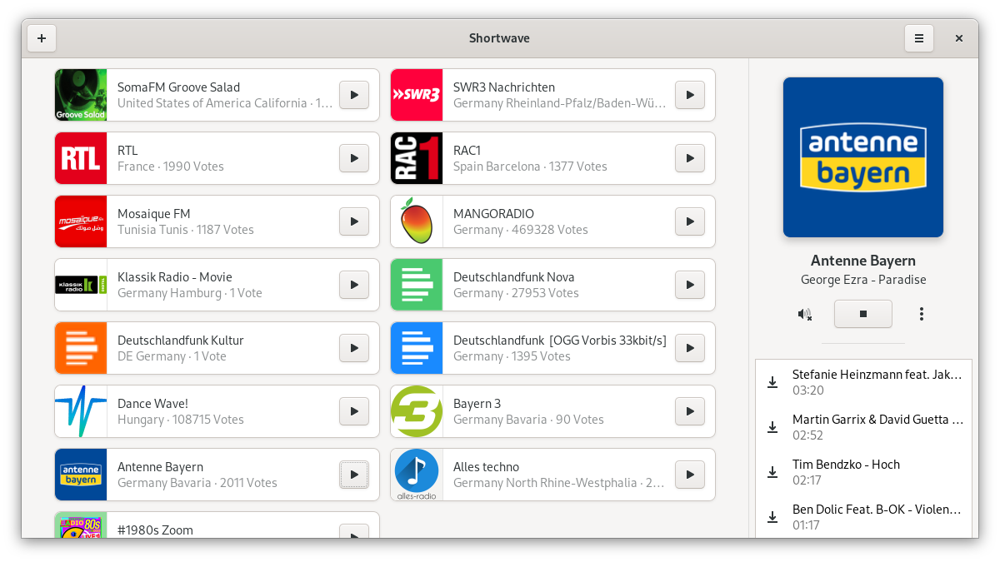
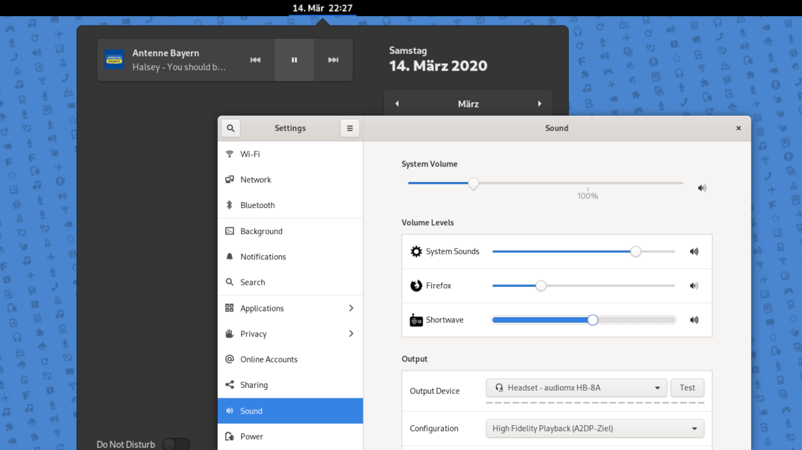
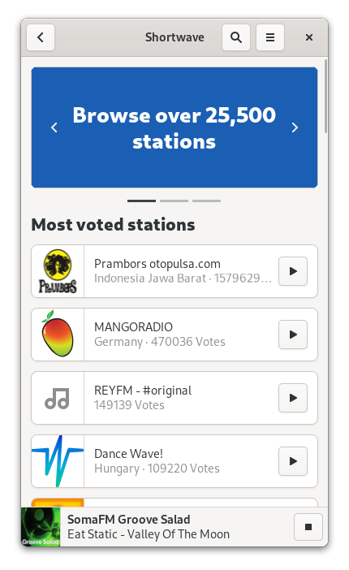
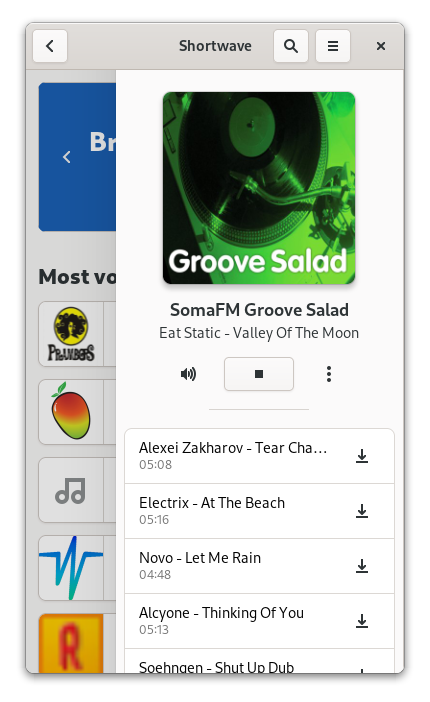

# Shortwave
Find and listen to internet radio stations

  
  

## Getting in Touch
If you have any questions regarding the use or development of Shortwave,
want to discuss design or simply hang out, please join us on our [#shortwave:gnome.org](https://matrix.to/#/#shortwave:matrix.org) channel.

## FAQ
- **Why its called 'Shortwave'?**

    Shortwave signals have a very long range because of their very good reflection properties. 
Due to their long range, they can be received almost anywhere in the world. 
The same applies to Internet radio stations, which can also be received almost anywhere in the world.
That's why we decided to call the project 'Shortwave', because internet radio stations and shortwave radio stations share many characteristics.

    If you want to know more about the naming process, you should read this [blog post](https://blogs.gnome.org/tbernard/2019/04/26/naming-your-app/)

- **Why I cannot edit stations anymore?**

    The edit feature is disabled because of vandalism. I cannot change this. [More information here](http://www.radio-browser.info/gui/#/) and [here](https://github.com/segler-alex/radiobrowser-api/issues/39)

- **Is Shortwave compatible with the Librem 5 / PinePhone?**

    Yes! We use the awesome [libadwaita](https://gitlab.gnome.org/GNOME/libadwaita) library to make the interface adaptive. The easiest way to get it on your phone is using the Flatpak package. [Flathub](https://flathub.org/apps/details/de.haeckerfelix.Shortwave) provides aarch64 packages.

- **Which database does Shortwave use?**

    [radio-browser.info](http://www.radio-browser.info/gui/#/). It's a community database. Everybody can add information.
    
- **How I can get debug information?**
    Run Shortwave using `RUST_BACKTRACE=1 RUST_LOG=shortwave=debug flatpak run de.haeckerfelix.Shortwave` (`.Devel`).

## Translations
Translation of this project takes place on the GNOME translation platform,
[Damned Lies](https://l10n.gnome.org/module/shortwave). For further
information on how to join a language team, or even to create one, please see
[GNOME Translation Project wiki page](https://wiki.gnome.org/TranslationProject).

## Flatpak builds
The recommended way of installing Shortwave is using the Flatpak package. If you don't have Flatpak installed yet, you can get it from [here](https://flatpak.org/setup/).

#### Stable builds
You can install stable builds of Shortwave from Flathub by using this command:

`flatpak install https://flathub.org/repo/appstream/de.haeckerfelix.Shortwave.flatpakref`

#### Nightly builds
You can install nightly builds of Shortwave by using this command:

`flatpak install https://haeckerfelix.de/~repo/shortwave.flatpakref`

More information are [here available](https://haeckerfelix.de/~repo/shortwave)! The repository is automatically updated every day. You can update to the latest nightly by running `flatpak update`!

## Building
### Building with Flatpak + GNOME Builder
Shortwave can be built and run with [GNOME Builder](https://wiki.gnome.org/Apps/Builder) >= 3.28.
Just clone the repo and hit the run button!

You can get Builder from [here](https://wiki.gnome.org/Apps/Builder/Downloads), and the Rust Nightly Flatpak SDK (if necessary) from [here](https://haeckerfelix.de/~repo/)

### Building it manually
1. `git clone https://gitlab.gnome.org/World/Shortwave.git`
2. `cd Shortwave`
3. `meson --prefix=/usr build`
4. `ninja -C build`
5. `sudo ninja -C build install`

You need following dependencies to build Shortwave:
- Rust 1.48 or later
- GTK 4
- Gstreamer 1.16 or later
- Sqlite3
- OpenSSL
- [libadwaita](https://gitlab.gnome.org/GNOME/libadwaita)
- [Meson Buildsystem](https://mesonbuild.com/)

If you need help to build Shortwave, please don't hesitate to ask [here](https://matrix.to/#/#shortwave:matrix.org)!

## Code Of Conduct
We follow the [GNOME Code of Conduct](/CODE_OF_CONDUCT.md).
All communications in project spaces are expected to follow it.
